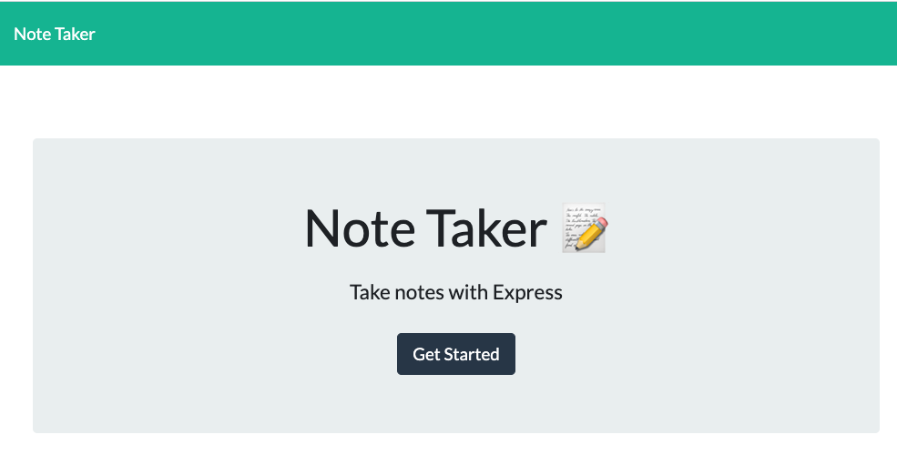
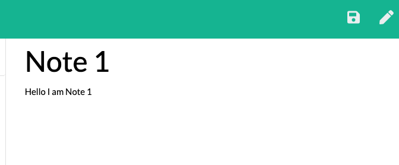
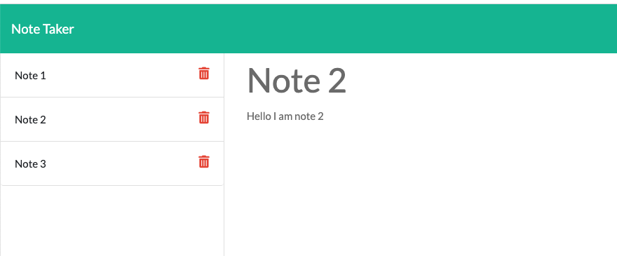
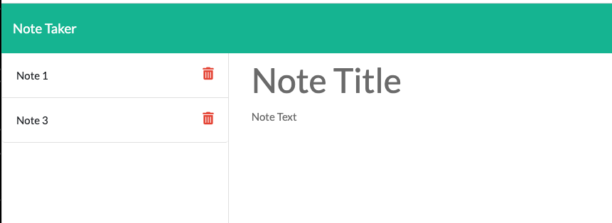

# 11 Express.js: Note Taker

## Description 

Hi, 

YOU Business Owner

YOU want to be able to write and save notes
SO THAT YOU can organize YOUR thoughts and keep track of tasks YOU need to complete

## Table of Contents (Optional)

* [Installation](#installation)
* [Usage](#usage)
* [Technology](#technology)
* [Credits](#credits)
* [License](#license)

## Installation

- Please visit Website https://richardyjkim.github.io/note-taker
or

- https://powerful-dusk-76502.herokuapp.com/

## Usage 

- Introducing Note Taker 
start Manage your Notes

- write Your note with Title and body, and save your note will appear on your left column

- You can always retrive your previous note simply clicking your notes on your left

- Done with our note, simply delete your note clicking trash bin next to it

## Technology
    -HTML
    -CSS
    -Java Script
    -nodejs
    -expressjs

## Credits

 - Richard Kim: richardyjkim (github)

## License

MIT License

Copyright (c) [2021] [Richard Y Kim]

Permission is hereby granted, free of charge, to any person obtaining a copy
of this software and associated documentation files (the "Software"), to deal
in the Software without restriction, including without limitation the rights
to use, copy, modify, merge, publish, distribute, sublicense, and/or sell
copies of the Software, and to permit persons to whom the Software is
furnished to do so, subject to the following conditions:

The above copyright notice and this permission notice shall be included in all
copies or substantial portions of the Software.

THE SOFTWARE IS PROVIDED "AS IS", WITHOUT WARRANTY OF ANY KIND, EXPRESS OR
IMPLIED, INCLUDING BUT NOT LIMITED TO THE WARRANTIES OF MERCHANTABILITY,
FITNESS FOR A PARTICULAR PURPOSE AND NONINFRINGEMENT. IN NO EVENT SHALL THE
AUTHORS OR COPYRIGHT HOLDERS BE LIABLE FOR ANY CLAIM, DAMAGES OR OTHER
LIABILITY, WHETHER IN AN ACTION OF CONTRACT, TORT OR OTHERWISE, ARISING FROM,
OUT OF OR IN CONNECTION WITH THE SOFTWARE OR THE USE OR OTHER DEALINGS IN THE
SOFTWARE.

© 2021 Trilogy Education Services, LLC, a 2U, Inc. brand. Confidential and Proprietary. All Rights Reserved.
